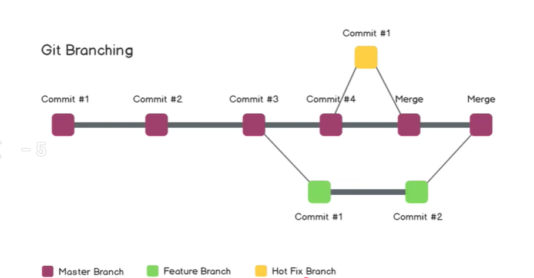

# Heading

Hello World

## Github Existing Project Commands

Git clone (link)  
git status - for all the details of changes  
git add . - to include all the modified file to github  
git commit -m "msg" - commit and msg   
git push orign main - to push to main 

## Local Project Pushing to Github Command

git init 
git add . 
git commit -m "msg" 
git remote push origin (link) 
git push origin main  
(if u want to use only git push then command - git push -u  origin main (now git push will work as git push origin main) ) 

## Git Branches

 

git branch - to check branches 
git checkout -b (branch name) - to create new branch 
git checkout (branch name) - to switch to that branch 

to merge to branch we do 

git diff - check diff code in 2 branchs  
git merge 